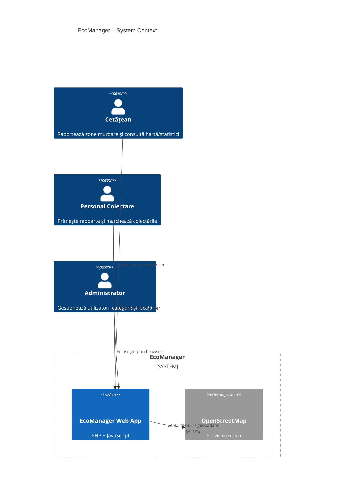
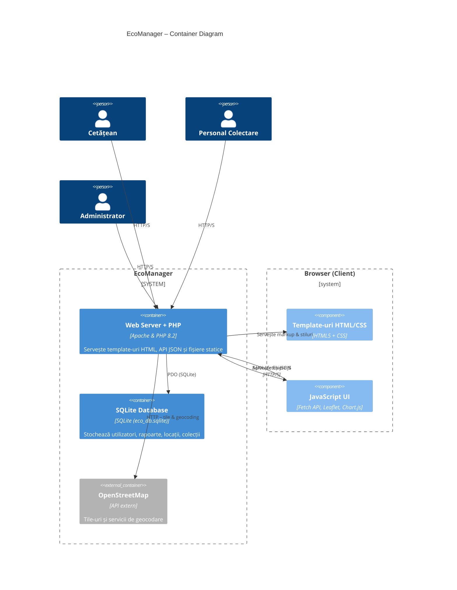
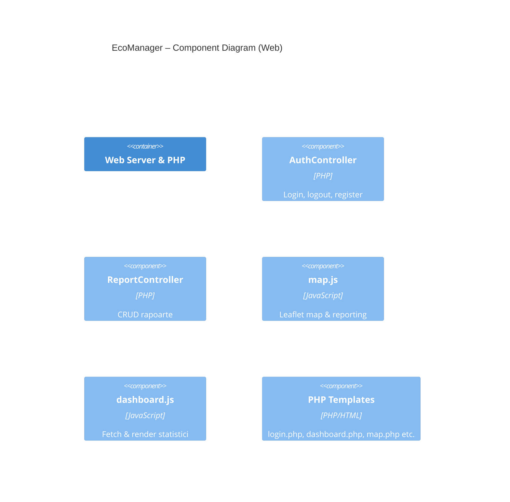
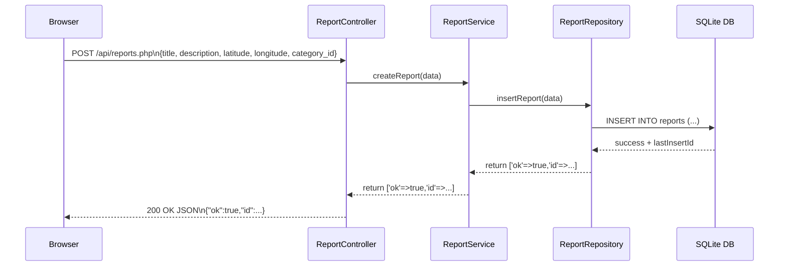

# EcoManager – C4 Architecture

---

## Level 1: Context

```mermaid
%%{init: {'theme':'default'}}%%
C4Context
title EcoManager – System Context

Person(citizen, "Cetățean", "Raportează zone murdare și consultă hartă/statistici")
Person(staff,   "Personal Colectare", "Primește rapoarte și marchează colectările")
Person(admin,   "Administrator", "Gestionează utilizatori, categorii și locații")

System_Boundary(ecosys, "EcoManager") {
  System(webapp, "EcoManager Web App", "PHP + JavaScript", "Oferă interfața web, API-uri JSON și logică de business")
  System_Ext(osm, "OpenStreetMap", "Serviciu extern", "Furnizează tile-uri de hartă și geocodare")
}

Rel(citizen, webapp, "Folosește prin browser")
Rel(staff,   webapp, "Folosește prin browser")
Rel(admin,   webapp, "Folosește prin browser")
Rel(webapp,  osm,    "Cereri tile-uri / geocodare", "HTTPS")
```

## Level 2: Container

```mermaid
C4Container
title EcoManager – Container Diagram

Person(citizen, "Cetățean")
Person(staff,   "Personal Colectare")
Person(admin,   "Administrator")

System_Boundary(ecomgr, "EcoManager") {
  Container(web, "Web Server + PHP", "Apache & PHP 8.2", "Servește template-uri HTML, API JSON și fișiere statice")
  Container(db,  "SQLite Database",  "SQLite (eco_db.sqlite)", "Stochează utilizatori, rapoarte, locații, colecții")
  Container_Ext(osm, "OpenStreetMap", "API extern", "Tile-uri și servicii de geocodare")
}

Rel(citizen, web, "HTTP/S")
Rel(staff,   web, "HTTP/S")
Rel(admin,   web, "HTTP/S")

Rel(web, db,  "PDO (SQLite)")
Rel(web, osm, "HTTP – tile & geocoding")

Boundary(browser, "Browser (Client)") {
  Component(html, "Template-uri HTML/CSS", "HTML5 + CSS")
  Component(js,   "JavaScript UI", "Fetch API, Leaflet, Chart.js")
}

Rel(web, html, "Servește markup & stiluri")
Rel(web, js,   "Servește fișiere JS")
Rel(js,  web,  "AJAX / fetch JSON", "HTTP/S")
```

## Level 3: Component

```mermaid
%%{init:{'theme':'base'}}%%
C4Component
title EcoManager – Component Diagram (Web)

Container(web, "Web Server & PHP") 
  Component(authCtrl,   "AuthController",   "PHP",       "Login, logout, register")
  Component(reportCtrl, "ReportController", "PHP",       "CRUD rapoarte")
  Component(mapJS,      "map.js",           "JavaScript","Leaflet map & reporting")
  Component(statsJS,    "dashboard.js",     "JavaScript","Fetch & render statistici")
  Component(templates,  "PHP Templates",    "PHP/HTML",  "login.php, dashboard.php, map.php etc.")
```

## Level 4: Code 
Example: src/controllers/ReportController.php

```mermaid
sequenceDiagram
    participant Browser
    participant API as ReportController
    participant Service as ReportService
    participant Repo as ReportRepository
    participant DB as SQLite DB

    Browser->>API: POST /api/reports.php\n{title, description, latitude, longitude, category_id}
    API->>Service: createReport(data)
    Service->>Repo: insertReport(data)
    Repo->>DB: INSERT INTO reports (...)
    DB-->>Repo: success + lastInsertId
    Repo-->>Service: return ['ok'=>true,'id'=>...]
    Service-->>API: return ['ok'=>true,'id'=>...]
    API-->>Browser: 200 OK JSON\n{"ok":true,"id":...}
```

